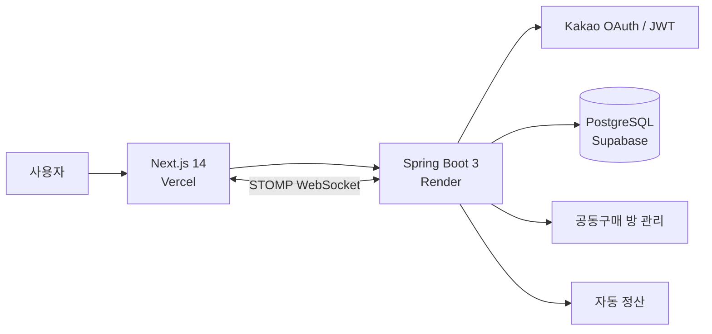

# 같이사 (Gateiseo)

> 공동구매부터 실시간 장바구니 공유, 자동 정산까지 한 번에 처리하는 서비스

같이사는 여러 사람이 함께 장을 볼 때 발생하는 **품목 공유, 실시간 변경 반영, 정산 계산**을 하나의 흐름으로 연결한 공동구매 서비스입니다.

Kakao OAuth 로그인, WebSocket 기반 실시간 동기화, 자동 정산 생성과 송금 완료 처리까지 구현하여 사용자가 방을 만들고 참여자를 초대하는 순간부터 정산을 마치는 과정까지 모바일 환경에서 간편하게 이용할 수 있도록 구성했습니다.

- **개발 형태:** 개인 프로젝트
- **담당 범위:** 기획 · UI 구현 · 프론트엔드 · 백엔드 · DB 설계 · 배포
- **Frontend:** Next.js 14 + TypeScript
- **Backend:** Spring Boot 3
- **Database:** PostgreSQL
- **Deployment:** Vercel + Render + Supabase

## 데모

🌐 **배포 서비스**

[https://gateiseo.vercel.app](https://gateiseo.vercel.app)

## 핵심 기능

### 카카오 로그인

- Kakao OAuth 2.0 기반 로그인
- 로그인 이후 JWT 기반 사용자 인증
- 인증 상태를 기반으로 서비스 접근 관리

### 공동구매 방

- 공동구매 방 생성
- 초대 코드를 통한 방 참여
- 초대 링크 복사 및 공유
- 참여자 기반 공동 장바구니 관리

### 실시간 장바구니

- 장바구니 품목 추가 및 삭제
- WebSocket(STOMP)을 활용한 실시간 변경 사항 동기화
- 동일한 방에 참여한 사용자에게 변경 내용을 즉시 반영

### 자동 정산

- 공동구매 품목을 기반으로 정산 결과 자동 생성
- 참여 인원을 기준으로 1인당 정산 금액 계산
- 사용자별 송금 완료 상태 관리
- 정산 진행 상태 확인

## 서비스 흐름

```text
카카오 로그인
     ↓
공동구매 방 생성
     ↓
초대 코드 / 링크 공유
     ↓
참여자 입장
     ↓
장바구니 품목 공동 작성
     ↓
WebSocket 기반 실시간 동기화
     ↓
구매 완료
     ↓
자동 정산 결과 생성
     ↓
송금 완료 처리
```

## 주요 구현 포인트

- **WebSocket(STOMP) 기반 실시간 동기화**

  - 동일한 공동구매 방에 참여한 사용자의 품목 추가·삭제 결과를 실시간으로 반영했습니다.

- **Kakao OAuth 2.0 + JWT 인증**

  - 카카오 계정을 통한 로그인 이후 JWT를 활용하여 프론트엔드와 백엔드 간 인증을 처리했습니다.

- **초대 기반 공동구매 방 참여**

  - 초대 코드와 링크를 이용해 사용자가 별도의 복잡한 과정 없이 공동구매 방에 참여할 수 있도록 구현했습니다.

- **자동 정산 로직**

  - 공유된 품목과 참여 인원을 기준으로 정산 결과를 자동 생성하여 사용자가 직접 금액을 계산해야 하는 과정을 줄였습니다.

- **정산 상태 관리**

  - 정산 이후 사용자별 송금 완료 여부를 관리하여 현재 정산 진행 상태를 확인할 수 있도록 구성했습니다.

- **모바일 우선 UI**

  - 실제 장보기 상황에서 빠르게 사용할 수 있도록 모바일 환경을 우선으로 화면과 사용자 흐름을 설계했습니다.

## 기술 스택

| 구분 | 기술 |
| --- | --- |
| Frontend | Next.js 14, TypeScript, Tailwind CSS |
| Backend | Spring Boot 3, Java 17, JPA / Hibernate |
| Database | PostgreSQL |
| Authentication | Kakao OAuth 2.0, JWT |
| Realtime | WebSocket, STOMP |
| Deployment | Vercel (Frontend), Render (Backend), Supabase (Database) |

## 시스템 아키텍처



## 배포 구성

```text
사용자
  ↓
Vercel
Next.js Frontend
  ↓
Render
Spring Boot Backend
  ↓
Supabase
PostgreSQL Database
```

- 프론트엔드는 **Vercel**에 배포했습니다.
- Spring Boot 백엔드는 **Render**에 배포했습니다.
- PostgreSQL 데이터베이스는 **Supabase**를 사용해 백엔드와 연동했습니다.

## 프로젝트 구조

```text
gateiseo/
├── frontend/                    # Next.js 프론트엔드
│   └── src/
│       ├── app/                 # 페이지 및 라우팅
│       ├── components/          # 공통 UI 컴포넌트
│       ├── hooks/               # React Hooks
│       ├── lib/                 # API 및 공통 로직
│       └── types/               # TypeScript 타입
│
├── backend/                     # Spring Boot 백엔드
│   └── src/main/java/com/gateiseo/
│       ├── controller/          # API Controller
│       ├── service/             # 비즈니스 로직
│       ├── repository/          # DB 접근
│       ├── domain/              # JPA Entity
│       ├── dto/                 # 요청 / 응답 DTO
│       ├── security/            # 인증 설정
│       └── websocket/           # WebSocket 설정
│
└── README.md
```

## 환경 변수

API 주소, 데이터베이스 연결 정보, OAuth 인증 정보, JWT Secret 등의 민감한 값은 GitHub에 직접 커밋하지 않고 환경 변수로 관리합니다.

### Frontend

```env
NEXT_PUBLIC_API_URL=http://localhost:8081
```

### Backend

백엔드에서는 다음과 같은 종류의 환경 설정이 필요합니다.

- PostgreSQL 연결 정보
- Kakao OAuth 인증 정보
- JWT Secret
- Frontend Origin 및 Redirect URL

실제 환경 변수 이름은 프로젝트 설정 파일을 기준으로 사용합니다.

## 로컬 실행 방법

### 1. Database 준비

로컬 PostgreSQL 환경 또는 Supabase PostgreSQL을 준비합니다.

### 2. Backend 실행

```bash
cd backend
./gradlew bootRun
```

기본 실행 주소:

```text
http://localhost:8081
```

### 3. Frontend 실행

새 터미널에서 실행합니다.

```bash
cd frontend
npm install
npm run dev
```

기본 실행 주소:

```text
http://localhost:3000
```

## 프로젝트 특징

- 기획부터 프론트엔드, 백엔드, DB 설계, 배포까지 전체 과정을 직접 구현한 개인 프로젝트
- WebSocket(STOMP)을 활용한 다중 사용자 실시간 데이터 동기화
- Kakao OAuth 2.0과 JWT를 결합한 인증 흐름 구현
- 사용자 초대부터 장바구니 공유, 정산 완료까지 연결되는 하나의 서비스 흐름 설계
- 자동 정산을 통해 공동구매 과정에서 발생하는 수동 계산의 불편함 개선
- Vercel, Render, Supabase를 활용해 프론트엔드·백엔드·데이터베이스를 각각 배포 및 연동
- 실제 사용 환경을 고려한 모바일 중심 UI 구현
